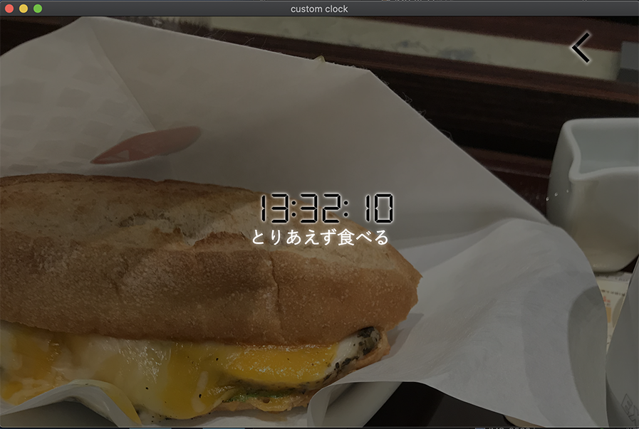

<h1>custom clock</h1>

<h2>デスクトップで使用するカスマイズできる時計アプリ</h2>

electronで開発した簡単な時計アプリ。一時期流行っていた○気出す時計的なアプリです。各時間に表示する画像を自分でセットしてメッセージも書き込めます。
通知をオンにするとオンにした時間帯に通知を出すこともできます。

セッティング画面

時計表示

<h3>その他オプション</h3>
<ul>
  <li>
    <h4>時計タイプ</h4>
    
時計のタイプ。タイプ1は普通のデジタル時計。タイプ2は画面の上で発光したような時計。

  </li>
  <li>
    <h4>文字の位置</h4>
    
top middle bottom から文字の表示位置を選べます。

  </li>
  <li>
    <h4>フォントカラー</h4>
    
RGBでフォントのカラーを選べます。

  </li>
  <li>
    <h4>save data</h4>
    
設定した画像、文を保存します。

  </li>
  <li>
    <h4>remove all data</h4>
    
設定したデータを全て消去します。

  </li>
</ul>
